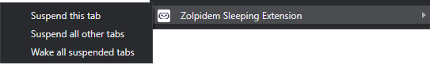
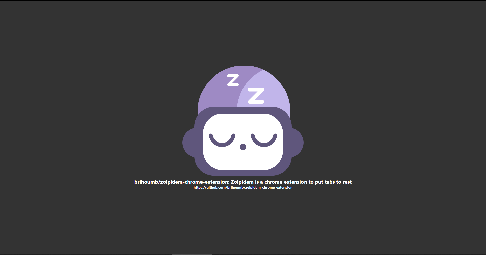

    
# Zolpidem Chrome-Extension #
Zolpidem is a free and open-source extension for Google Chrome to free ram when using lot of tabs.  
It acts like the great suspender but in a cheap version.  
#### Before upgrading the extension you **must** export your tabs or unsuspend them otherwise you will lose them! ####

## How to use the extension: ##
### Commands: ###
You can bind your own shortcuts at `chrome://extensions/shortcuts`.  

|  | Windows and Linux  | Mac user | Description |
| ------------ | ------------------ | -------- | ----------- |
| Suspend current tab | Ctrl + Shift + F  | Command + Shift + F  | Suspend the active tab in the window.  |
| Suspend all other tab | Ctrl + Shift + G  | Command + Shift + G  | Suspend all other tabs in the window.  |
| Awake all tabs | Ctrl + Shift + H | Command + Shift + H | Awake all tabs that are currently suspended. |  

## Context Menu: ##
You can right click anywhere on your window to create a context menu and select an action.  
  

### Pop-up: ###
On the top right corner you will have a pop-up (or in the little puzzle piece).  
  
You can suspend the current tab with the 💤 button, all other tabs with 🌙 and wake all tabs with 🌞.  
This pop-up allows you to export your tabs and their group in a JSON file called `session.json`.  
You can then import your tabs by either drag&drop your JSON onto the `Choose a file` button **or** by selecting it by clicking on the button.  
The tabs are opened on a new window to avoid overloading your current window.  

## Suspended tab: ##
To restor a suspended tab you can either click anywhere on the window or hit ctrl+r or f5.  
  
*A suspended tab shows you it's title and the URL suspended.*  

## Contributing to this extension ##
Contributions are very welcome. Feel free to submit pull requests for new features and bug fixes.  
For new features, raise an issue for the proposed change first so we can discuss about the ideas.

## Licensing ##
This software is bla bla bla license bla bla bla -> read this [license.md](LICENSE.md)

## Credit ##
Code by @brihoumb  
Logo by @AydenQUILLET

---  

# **NERD ZONE** #
## Install from release ##
1. Download the file [`zolpidem.zip`](https://github.com/brihoumbzolpidem-chrome-extension/releases/download/1.1.0/zolpidem.zip)
2. Drag and drop `zolpidem.zip` in `chrome://extensions`.
3. You can now use zolpidem chrome-extension everywhere.

## Compile the source and install your own crx ##
1. Clone the repository.
2. Install the dev dependencies of the project with npm.
3. Run `npm run build`.
4. Drag and drop `zolpidem.crx` in `chrome://extensions`.
5. Voilà, you have the extension installed.

## Install as an extension from source ##
1. Download the master branch as zip and unarchive to your preferred location (whichever suits you).
2. Using Google Chrome browser, navigate to `chrome://extensions/` and enable "Developer mode" in the upper right corner.
3. Click on the `Load unpacked extension` button.
4. Browse to the `src` directory of the unarchived folder and confirm.
5. Enjoy the extension.
